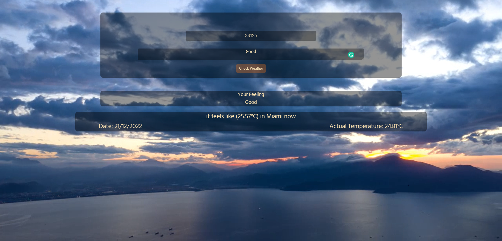

# Weather Journal App

This project is part of [Professional Web Development NanoDegree](https://egfwd.com/specializtion/web-development-professional/?utm_source=googlesearch&utm_medium=ads&utm_campaign=branding&utm_adgroup=Udacity&gclid=Cj0KCQiAnNacBhDvARIsABnDa6-vuTZmWIK4LK3uvTdPQ_sBo153HdzwvuaFkYypzU3cS3b2wWVWOYkaAmEdEALw_wcB) Provided by [Udacity](https://www.udacity.com) and Sponsored by [EGFWD](https://www.egfwd.com/)

## => [Live Demo](https://weather-journal-app.abdelaziz-elshr.repl.co/)



## Technologies Used

    -HTML
    -CSS
    -Vanilla Javascript
    -Node.js
    -Express

## Project Details

    -this project about learning how to deal with remote api and how to handle the data 
     with the static website

    -first the the api key retrieved by the frontend side from the server side by the
     route ```/apikey``` 
    
    -next the retrieved api key used with the baseUrl line 8 in [app.js]
     (./website/app.js) and the zip code from user input to get the weather object

    -then the weather object and the user input sent to the server via post request 
     to the route ``` /userinput ``` the userinput server side then save the data in object

    -the saved object in the server then sent to the frontend side by the route ```/data```
     and the ui dynamically updated with the sent data

    -there is some error handlers added as UI form validation to control the user input

## Installation

    -first rename the .env_sample to .env and use the file to assign the port
     and the API key this important and with out this step the project won't work 

    -after assigning the environment variables use the command ```npm i``` to install the dependencies 
    
    -then use the command `npm start` to start the server
     and open the browser on `http://localhost:your port here`

    -then type the zip code in the right way to retrieve the weather data
